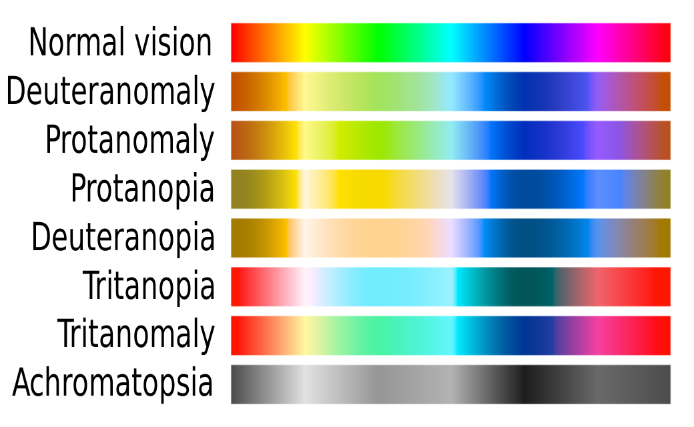

# Exercise 02

Implement a color mapping application that helps people who are color blind see the colors around them.


## Presentación

Toda la información, métodos de simulación y corrección fueron obtenidos del artículo: **An Adaptive Fuzzy-Based System to Simulate, Quantify and Compensate Color Blindness** [1]

## Introducción

El daltonismo es un conjunto de patologías de la visión que se caracterizan por una reducción total o parcial de la capacidad de percibir algunos colores o en casos extremos, como la Acromatopsia[2], de todos los colores; a nivel físico, esto se traduce en la imposibilidad o dificultad de alguno de los 3 fotoreceptores del ojo (Rojo para frecuencias de luz bajas, Verde para frecuencias de luz medias y Azules para frecuencias de luz altas) para percibir dichos espectros

Dando una explicación más detallada: Dentro de la retina existen dos tipos de células sensoriales especializadas en captar los estímulos luminosos, los bastones y los conos. Los bastones poseen una alta sensibilidad a la luz acromática mientras que los conos poseen menos sensibilidad a la luz pero son capaces distinguir entre diferentes longitudes de onda. Cómo se mencionó en el primer párrafo, existen tres tipos diferentes de conos en el ojo humano, cad uno especializado en percibir una tonalidad específica (Rojo, Verde y Azul).

Existen 3 clasificaciones distintas de anomalías relacionadas con la percepción del color, las cuales también tienen subclasificaciones
- Tricromacía anomala:
    * Protanomalia: Sensibilidad al color rojo reducida
    * Deuteranomalia: Sensibilidad al color verde reducida
    * Tritanomalia: Sensibilidad a los colores en el rango azul-amarillo reducida.
- Dicromatismo: 
    * Protanopia: Ausencia del cono fotoreceptor de frecuencias bajas (Rojo).
    * Deuteranopia: Ausencia del cono fotoreceptor de frecuencias medias (Verde).
    * Tritanopia: Ausencia del cono fotoreceptor de frecuencias altas (Azul).
- Acromatopsia: Ausencia o sensibilidad reducida en todos los conos fotoreceptores.

La imagen 1 representa gráficamente las bandas expectrales de cada tipo de discapacidad comparada con la visión normal.

**Nota:** Para ver imagen completa, revisar [3]

## Antecendentes

Los métodos clásicos para simular el daltonismo, normalmente se centran en modelos matemáticos que sólo toman en cuenta los casos de dicromatismo, donde el nivel de discapacidad es del 100%, ignorando que los casos reales de daltonismo generalmente son de tricromacía anómala, donde el nivel de discapacidad para determinado color es más orientado a niveles y porcentajes.

El artículo citado se enfoca en revisar y corregir las tonalidades para diferentes grados de Deuteranomalia, Protanomalia y un híbrido entre ambas, para ello, se exploran dos métodos distintos, de los cuales, en el presente trabajo, sólo nos enfocaremos en uno, el método **B**, el cual se basa en transformaciones lineales que permiten "corregir adaptativamente los efectos de la peturbación cromática".

## Consideraciones

Aunque dentro del código final realizado, es posible cambiar el grado de Deuteranomalia y Protanomalia modificando las variables **ad** y **ap**, respectivamente, de su valor inicial 1 (Que representa el 100%) a cualquier porcentaje inferior, para efectos prácticos y de tiempo en cuanto a la presentación del ejercicio, hemos decicido realizar dicha presentación utilizando sólo los valores correspondientes al 100% de discapacidad visual de cada una de las alteraciones, lo que es lo mismo, evaluar los caos de Deuteranopia y Protanopia.

Por lo tanto, en el presente ejercicio sólo se abordarán 4 de los 7 tipos de daltonismo, dando mayor relevancia en el producto final a los dos más extremos, Deuteranopia y Protanopia.

Finalmente cabe hacer la aclaración de que en el documento original, los autores proponen un nuevo caso mezclando ambas discapacidades, la cual también abordaremos en el presente ejercicio como un extra.

## Procedimiento

### Simulación

El algoritmo de simulación que utilizaremos se basa en el modelo LMS (Longwave, Middlewave, Shortwave), ya que este representa los colores con un comportamiento más parecido al de los ojos humanos que el modelo RGB (Red, Green, Blue). Lo primero que harémos al tener nuestra imagen de referencia será convertir sus componentes RGB a componentes LMS, esta conversión se logra mediante una conversión lineal representada de la siguiente forma:

 
\begin{bmatrix} L\\ M\\ S \end{bmatrix} = \begin{bmatrix} 17.8824 & 43.5161 & 4.1194\\ 3.4557 & 27.1554 & 3.8671\\ 0.0300 & 0.1843 & 1.4671 \end{bmatrix} \begin{bmatrix} R\\ G\\ B \end{bmatrix}


Nuestro segundo paso es convertir los valores LMS de la imagen al dominio de color que ve cada persona con discapacidad visual.

Para Protanopia y Protanomalia, la conversión lineal es:

 
\begin{bmatrix} Lp\\ Mp\\ Sp \end{bmatrix} = \begin{bmatrix} (1-ap) & 2.0234*ap & -2.5258*ap\\ 0 & 1 & 0\\ 0 & 0 & 1 \end{bmatrix} \begin{bmatrix} L\\ M\\ S \end{bmatrix}


Y para la Deuteranopia y Deuteranomalia, la conversión lineal es:

 
\begin{bmatrix} Ld\\ Md\\ Sd \end{bmatrix} = \begin{bmatrix} 1 & 0 & 0\\ 0.4942*ad & (1-ad) & 1.2483*ad\\ 0 & 0 & 1 \end{bmatrix} \begin{bmatrix} L\\ M\\ S \end{bmatrix}


**Nota:** Para el modelo híbrido, simplemente se deben combinar ambas matrices, por ejemplo, colocando la primera fila de Protanopia/Protanomalia en la correspondiente fila de la matriz de Deuteranopia/Deuteranomalia y visceversa.

Finalmente debemos devolver los valores LMS a RGB, lo cual se puede lograr con la siguiente operación:

 
\begin{bmatrix} R\\ G\\ B \end{bmatrix} = \begin{bmatrix} 0.0809 & -0.1305 & 0.1167\\ -0.0102 & 0.0540 & -0.1136\\ -0.0004 & -0.0041 & 0.6935 \end{bmatrix} \begin{bmatrix} L\\ M\\ S \end{bmatrix}


Y el resultado será una imagen con los colores modificados al espectro que verían las personas con Protanopía y Deuteranopia.

### Correción

Como se ha mencionado anteriormente, el método elegido para realizar la corrección es el B, el cual se basa en las aplicaciones prácticas de la **lógica difusa**[4], específicamente, la idea práctica de esta solución se enfoca en compensar la dificultad de percepción de una determinada banda del espectro, distribuyendo la información de dicha banda en las otras dos, a continuación se detalla su procedimiento:

Para **Protanopia** y **Protanomalia**, tomamos la expresión 
f' = (f_r, f_g, f_b) 
como la imagen original con sus tres bandas de colores RGB.

La imagen original se modifica mediante la función
 
f' = (f'_r, f_g, f'_b), \begin{cases}
f'_g = \frac{ap}{2}f_r + \frac{2-ap}{2}f_g\\
f'_b = \frac{ap}{2}f_r + \frac{2-ap}{2}f_b
\end{cases}


De la misma forma, ara **Deuteranopia** y **Deuteranomalia**, tomamos la expresión 
f' = (f_r, f_g, f_b) 
y la convertimos mediante la función
 
f' = (f'_r, f_g, f'_b), \begin{cases}
f'_r = \frac{ad}{2}f_g + \frac{2-ad}{2}f_r\\
f'_b = \frac{ad}{2}f_g + \frac{2-ad}{2}f_b
\end{cases}


Cómo se mencionó en la sección de antecendentes, el documento citado propone unaS discapacidad visual producto de la mezcla de Protanopia/Protanomalia y Deuteranopia/Deuteranomalia, para la corrección de esta variación es necesario realizar la siguiente operación:

 
\begin{bmatrix} R'\\ G'\\ B' \end{bmatrix} = \begin{bmatrix} 1-\frac{ad}{2} & \frac{ad}{2} & 0\\ \frac{ap}{2} & 1-\frac{ap}{2} & 0\\ \frac{ap}{4} & \frac{ad}{4} & 1-\frac{ap+ad}{4} \end{bmatrix} \begin{bmatrix} L\\ M\\ S \end{bmatrix}


## Solución



## Código

## Conclusiones

El estudio revisado plantea varias conclusiones.

1 - Los modelos que simulan grados intermedios de Protanomalia y Deuteranomalia realmente son poco frecuentes, la mayoría de trabajos se centran en emular los grados extremos (Protanopia y Deuteranopia), lo cual es un hecho curioso dado que las formas extremas de daltonismo no son tan comunes.

2 - La herramienta presentada aquí es adaptativa en cuanto permite modificar la simulación y la solución dependiendo del grado de discapacidad que cada persona poseo en sus conos que perciben el rojo y/o el verde.

3 - Los autores señalan la poca literatura existente que propongan métodos para lograr la compensación adaptativa del daltonismo.

4 - El daltonismo, al ser una afectación que no muchas personas padecen y que un buen porcentaje de aquellas que sí, no lo saben, es difícil de estudiar y aún más difícil comprobar la eficacia de los métodos orientados a mitigarla, el estudio señala que la falta de una muestra estadisticamente significativa, entorpece la labor de probar herramientas adaptativas en la vida real, recalcando nuevamente, que la mayoría de la literatura se centra tan sólo en los casos extremos.

5 - Finalmente, los autores relatan que provaron la herramienta propuesta en una muestra de 40 personas logrando resultados positivos a un buen nivel, siendo el método B, mejor calificado que el A.

Pequeña conclusión de nuestra parte: El método A nos fue imposible de implementar, dado que el libro en que está basado y que contiene las formulas y explicaciones necesarias, es demasiado difícil de conseguir.

## Trabajo futuro   

1 - Nos gustaría poder probar la herramienta realizada en el presente trabajo, con una muestra real, en lo posible mayor a la del estudio original, para lograr cuantificar el porcentaje de mejora que esta logra en las imagenes para la gente con los tipos de daltonismo especificados aquí.

2 - La interfaz de usuario, como ya hemos específicado, para fines prácticos y de presentación, inicialmente sólo permite la modificación de imagénes tomando los casos extremos de protanopia y deuteranopia, cuando el nivel de ceguera en los conoso verde y rojo es del 100%, no obstante, cambiando las variables que poseen este porcentaje en el código, es posible probar la solución en los niveles intermedios de protanomalia y deuteranomalia, queda como trabajo futuro el hacer que la opción de modificación de dichas variables pueda realizarse directamente desde la interfaz del usuario.

3 - Un punto bastante fuerte en el que se podría ampliar, es que en el presente estudio sólo se abordaron 4 de los 7 tipos de daltonismo más comunes, dejando de lado la Tritanomalia, Tritanopia y Acromatopsia; la simulación y corrección de estos 3 tipos quedan para un trabajo futuro.

4 - Finalmente, los autores propusieron un modelo combinado de de protanopia/protanomalia y deuteranopia/deuteranomalia el cual refleja la existencia de posibles alteraciones que combinan varias de las anomalías más comunes y cuyo estudio y corrección, en un modelo mucho más amplio y adaptable que el propuesto, queda como trabajo futuro.

## Referencias
[1] Lee, J., & Santos, W. P. D. (2010). An adaptive fuzzy-based system to simulate, quantify and compensate color blindness. Integrated Computer-aided Engineering, 18(1), 29-40. https://doi.org/10.3233/ica-2011-0356

[2] Avanzada, Á. O. (2020, 5 junio). Acromatopsia, el mundo en blanco y negro. Área Oftalmológica Avanzada. https://areaoftalmologica.com/retina/acromatopsia/

[3] Wikipedia contributors. (2023, marzo 19). Color blindness. Wikipedia. https://en.wikipedia.org/wiki/Color_blindness

[4] Wikipedia contributors. (2023b, abril 3). Fuzzy logic. Wikipedia. https://en.wikipedia.org/wiki/Fuzzy_logic